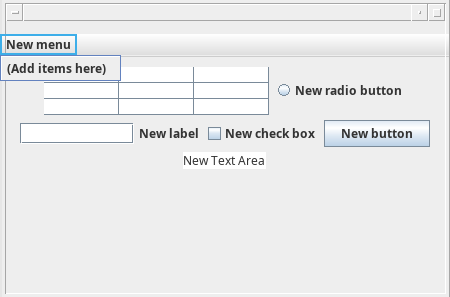

::: {#exr-memory-layout}
Определите, где хранятся (stack/heap) объекты в приведённом коде.

```java
public static void method(Number n) {
    int i = 0;
    char c = 'a';
    Integer j = 2;
    String str = "Happy test";
    Object o = new Object();
    int[] arr = new int[]{1,2,3};
}
```
:::

::: {#exr-garbage-collection}

Какие объекты остануться в памяти программы после сборки мусора?

``` java
String s = "Привет ";
for(int i = 0; i < 5; i++)
    s = s + i;
System.gc();
System.out.println(s);
```

:::

::: {#exr-git-workflow}
Дано проект со следующим деревом каталогов. Для него настроен удалённый репозиторий **git**. Символом `~` отмечены изменённые файлы. Введите команды для сохранения изменений и отправки их в удалённый репозитирий.

```
java
├── .git
├── readme.md ~
└── src
    ├── bsu
    │   └── load.java ~
    ├── main.java ~
    └── test
        └── test.java
```

:::

::: {#exr-generics}
Зачеркинте строчки в которых содержатся ошибки.

``` java
class A{}
class B extends A{}
ArrayList<int> il;
ArrayList<A> al = new ArrayList<A>();
al.add(new B());
al.add(new A());
B b = al.get(0);
ArrayList<B> bl = new ArrayList<B>();
bl.add(new B());
bl.add(new A());
A a = bl.get(0);
```

:::

::: {#exr-exceptions}

Корректнен ли следующий код? Если нет, то исправьте его.

``` java
void calc(int a) {
    if(a == 0) throw new Exception();
}

void method(){
    try {
calc();
    } catch(Exception e) {}
}
```
:::

:::: {#exr-file}

Выберете наиболее безопасноый способ работы с файлом и поясните свой выбор.

::: {layout-ncol="2"}

``` java
try {
    var in = new FileInputStream("1.txt");
    ...
    in.close();
} catch(IOException e) {}
```

``` java
FileInputStream in = null;
try
{
    in = new FileInputStream("1.txt");
} catch(IOException e){}
finally {
    if (in != null) {
try {
    in.close();
} catch (IOException ex) {}
    }
}
```

:::
::::

::: {#exr-path} 

Используя дерево каталогов проекта @exr-git-workflow мы находимся в каталоге `src`. Укажите:


1.  Абсолютный путь к файлу `load.java`
2.  Отностительный путь к файлу `test.java`
3.  Относительный путь к файлу `readme.md`
:::

:::: {#exr-classes}

В приведённом коде определите:

::: {layout-ncol="2"}

``` java
class A {
    static class B {}
    class C {}
    void method() {
        class D{}
        var a  = new Runnable(){
            public void run() {}
        };
    }
}
```

1.  Локальный класс
2.  Анонимный класс
3.  Внутренний класс
4.  Статически вложенный класс

:::
::::

:::: {#exr-equals}
Выберите правильную реализацию сравнения двух строк и объясните свой выбор.

::: {layout-ncol="2"}

``` java
boolean compare(String a, String b) {
    return a==b;
}
```

``` java
boolean compare(String a, String b) {
    return a.equals(b);
}
```

:::

`\newpage`{=latex}

::::

:::: {#exr-encapsulation}

Выберите реализацию, которая соответвует принципам ооп, объясните свой выбор.


::: {layout-ncol="2"}

``` java
class A{
    public int a;
    public double b;
    public static String txt(A o) {
        return "a="+o.a+";b="+o.b;
    }
}
```

``` java
class A{
    private int a;
    private double b;
    public int getA() {
        return a;}
    public void setA(int a) {
        this.a = a;}
    public String txt() {
        return "a="+a+";b="+b;
    }
}
```

:::

::::


:::: {#exr-io}
Определите соответствие классов и систем

::: {layout-ncol="2"}
1.  InputStream, OutputStream
2.  Buffer, Chanel, Path
3.  Thread, BlockingQueue

a.  Блокирующий ввод.вывод (IO)
b.  Новый (неблокирующий) ввод вывод (NIO)
c.  Многопоточное выполнение

:::
::::

::: {#exr-race-condition}

Безопасен ли следующий код в многопоточной среде? Если нет, то исправьте его используя ключевое слово.

``` java
class Test {
    static void calc(){
        for(int i = 0; i<100000; i++){
            int k = global;
            k++;
            global = k;}}
    static int global = 0;
    public static void main() {
        for(int i = 0; i < 5; i++)
            new Thread(new Runnable(){
                public void run(){
                    calc();
                }}).start();
    }}
```

:::

`\newpage`{=latex}


::: {#exr-modifyers}
В приведённом коде зачеркините несовместимые модификаторы.

``` java
final interface {}
abstract static class {}
abstract class A{
    private static A();
    public protected final int a;
}
final abstract class M{}
```

:::

::: {#exr-gui}
Определите, какие графические элементы библиотеки Swing были использованы на рисунке. Приведите названия классов.

{width="6cm"}

:::

:::: {#exr-autoboxing}
Какой код выполнится быстрее и будеть содержать меньшее число операций. Почему?

::: {layout-ncol="2"}

``` java
var arr = new Double[]{1,2,3};
double sum = 0;
for(Double d : arr)
        sum+=d;
```

``` java
var arr = new double[]{1,2,3};
double sum = 0;
for(double d : arr)
        sum+=d;
```

:::

::::

::: {#exr-modeling}

Спроектируйте иерархию классов, представляющих животных. Все животные обладают некоторыми общими характеристиками, но также имеют уникальные особенности. Все животные могут двигаться и спать. `Собака` лает, `кошка` мяукает, а соловей умеет петь и летать. Животное может быть диким и домашним, у домашенго животного должна быть кличка. При необходимости используйте интерфейсы и абстрактные классы.

:::
